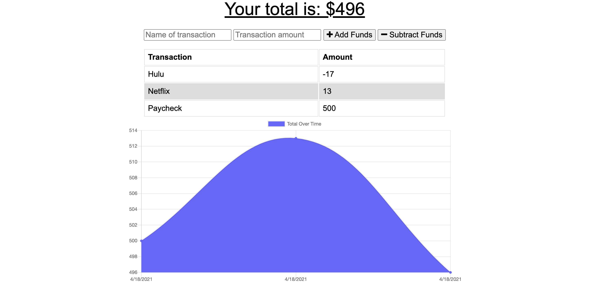

# Budget Buddy
An application to track purchases and manage your budget.


## Description

A personal budget tracker allowing the user to input their expenses and income. Users can view a chart of their spending to track their budget. This application is also available offline.

## Table of Contents

* [Reference](#reference)
* [Details](#details)
* [Technologies](#technologies)
* [Installation](#installation)
* [Usage](#usage)
* [License](#license)
* [Contributing](#contributing)
* [Questions](#questions)
  
## Reference

Click [here](https://budget-buddy-tracker.herokuapp.com/) to view the live application on Heroku.

Screenshot of application
  

## Details
  * Homepage shows an empty chart, two input fields for transaction name and amount, and two buttons to add or subtract funds.
  * Clicking add or subtract will regenerate chart to add expense to budget history.
  * If user is offline, they will still be able to add or subtract funds. Onced online, the database will be updated through IndexedDB.
  * Pages are also cached for optimal online experience.
  
## Technologies
Technologies used: CSS, JavaScript, MongoDB, Mongoose, Express, dotenv, IndexedDB, Morgan, Compression, PWA technologies (manifest, service-worker, etc).

## Installation

To install all necessary materials for this project, run the following command:

```
npm install
```

## Usage

Be sure to install all node modules and packages locally before using the application, and to create a .env with your information. 

## License

This application is protected under the MIT license.

For more information, visit this link: [MIT Info](https://opensource.org/licenses/MIT)

## Contributing
Design may be changed to the contributors needs and taste.

## Questions

If you have any questions, please reach out.
* GitHub: [AHFotis](https://github.com/AHFotis)
* Email: annahickey2@gmail.com
